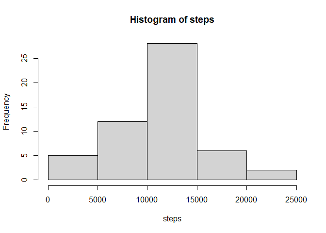
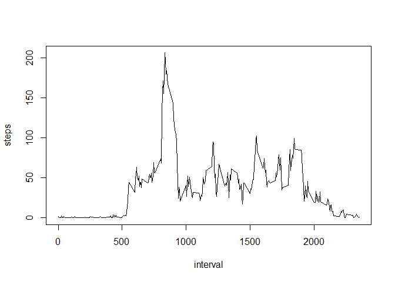
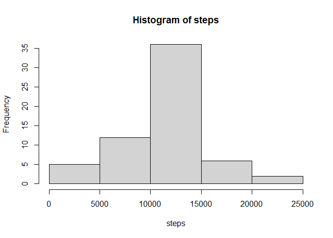
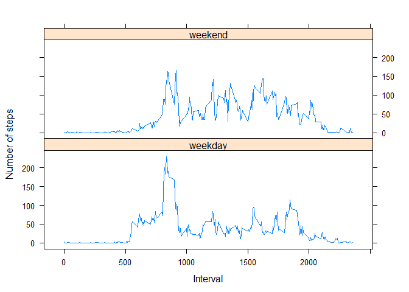

## Loading and preprocessing the data

Reading & printing the head of the `activity.csv`

```r
df <- read.csv('activity.csv')
head(df)
```

```
##   steps       date interval
## 1    NA 2012-10-01        0
## 2    NA 2012-10-01        5
## 3    NA 2012-10-01       10
## 4    NA 2012-10-01       15
## 5    NA 2012-10-01       20
## 6    NA 2012-10-01       25
```

Changing the date from factor to date type

```r
df$date <- as.Date(as.character(df$date))
head(df)
```

```
##   steps       date interval
## 1    NA 2012-10-01        0
## 2    NA 2012-10-01        5
## 3    NA 2012-10-01       10
## 4    NA 2012-10-01       15
## 5    NA 2012-10-01       20
## 6    NA 2012-10-01       25
```

## What is mean total number of steps taken per day?

Total Steps Taken Each Day

```r
steps <- tapply(df$steps, df$date , sum)
steps_tbl <- data.frame(steps)
head(steps_tbl)
```

```
##            steps
## 2012-10-01    NA
## 2012-10-02   126
## 2012-10-03 11352
## 2012-10-04 12116
## 2012-10-05 13294
## 2012-10-06 15420
```

Histogram of Number of Steps Taken Each Day

```r
hist(steps)
```

<!-- -->

Mean

```r
mean(steps, na.rm=T)
```

```
## [1] 10766.19
```

Median 

```r
median(steps, na.rm=T)
```

```
## [1] 10765
```

## What is the average daily activity pattern?

Plot of Interval and the Average number of steps taken

```r
tbl <- aggregate(steps~interval, data=df, mean, na.rm=T)
plot(tbl$interval, tbl$steps, type='l', xlab='interval', ylab='steps')
```

<!-- -->

Interval which has Maximum Number of Steps

```r
tbl[which.max(tbl$steps),]
```

```
##     interval    steps
## 104      835 206.1698
```

## Imputing missing values

Total number of missing values in the dataset

```r
sum(is.na(df))
```

```
## [1] 2304
```

Imputation

```r
ndf <- df
fills <- aggregate(steps~interval,data=df,mean,na.rm=T)
ndf$steps <- ifelse(is.na(df$steps), round(fills$steps[match(df$interval, fills$interval)],0), df$steps)
head(ndf)
```

```
##   steps       date interval
## 1     2 2012-10-01        0
## 2     0 2012-10-01        5
## 3     0 2012-10-01       10
## 4     0 2012-10-01       15
## 5     0 2012-10-01       20
## 6     2 2012-10-01       25
```

Total Steps Taken Each Day

```r
steps <- tapply(ndf$steps, ndf$date , sum)
hist(steps)
```

<!-- -->

Mean

```r
mean(steps, na.rm=T)
```

```
## [1] 10765.64
```

Median 

```r
median(steps, na.rm=T)
```

```
## [1] 10762
```

No, they don't really differ that much  
there's no as such impact of imputation  

## Are there differences in activity patterns between weekdays and weekends?

Creating Factor(weekday, weekend)

```r
ndf['day'] <- weekdays(ndf$date)
str(ndf)
```

```
## 'data.frame':	17568 obs. of  4 variables:
##  $ steps   : num  2 0 0 0 0 2 1 1 0 1 ...
##  $ date    : Date, format: "2012-10-01" "2012-10-01" ...
##  $ interval: int  0 5 10 15 20 25 30 35 40 45 ...
##  $ day     : chr  "Monday" "Monday" "Monday" "Monday" ...
```

```r
days <- NULL
for(x in ndf$day){
    if(x == 'Saturday' | x == 'Sunday'){
        days <- c(days, 'weekend')
    }
    else{
        days <- c(days, 'weekday')
    }
}
ndf['day'] = factor(days)
str(ndf)
```

```
## 'data.frame':	17568 obs. of  4 variables:
##  $ steps   : num  2 0 0 0 0 2 1 1 0 1 ...
##  $ date    : Date, format: "2012-10-01" "2012-10-01" ...
##  $ interval: int  0 5 10 15 20 25 30 35 40 45 ...
##  $ day     : Factor w/ 2 levels "weekday","weekend": 1 1 1 1 1 1 1 1 1 1 ...
```

Plot on Interval and the Average number of steps taken, averaged across all weekday days or weekend days

```r
tbl <- aggregate(steps ~ interval + day, ndf, mean)
library(lattice)
xyplot(steps ~ interval | day, tbl, type = "l", layout = c(1, 2),xlab = "Interval", ylab = "Number of steps")
```

<!-- -->


